## About

* The data in `train_data.csv` is related to cancer diagnoses of different types.
* Each case includes information on the properties (`radius`, `texture` and `perimeter`) of the three most characteristic cell nuclei.
* Moreover, the `age` of the person, the `date of the diagnose` and `treatment start`, as well as the `cancer type` is available.
* The same information is also present in the `test_data.csv`, only the cancer type is missing.

    1. Perform an exploratory data analysis
    2. Create a model for predicting the `cancer_type`
    3. Build a regression model for predicting `radius_2` based on `perimeter_1`

## Importing Data

* The first step is to look at the size of the data. Number of columns and rows are investigated with shell commands.


```python
%%bash

wc -l "candidate_data/train_data.csv"
wc -l "candidate_data/test_data.csv"
```

         399 candidate_data/train_data.csv
         172 candidate_data/test_data.csv


```python
cat "candidate_data/train_data.csv" | head -2
```


__Notes__:
* All but `treatment_date` and `diagnose_date` columns seems to have numeric data type.


```python
%%bash

head -1 "candidate_data/train_data.csv" | tail -1 | sed 's/,/ /g' | wc -w
head -1 "candidate_data/test_data.csv" | tail -1 | sed 's/,/ /g' | wc -w
```

          13
          12


* Next step is to import the necessary libraries.


```python
from collections import Counter
from datetime import datetime

import numpy as np
import pandas as pd
import matplotlib.pyplot as plt
import seaborn as sns
```


```python
%matplotlib inline
```


```python
train = pd.read_csv("candidate_data/train_data.csv", parse_dates=['treatment_date', 'diagnose_date'])
test = pd.read_csv("candidate_data/test_data.csv", parse_dates=['treatment_date', 'diagnose_date'])
```


```python
train.info()
```

    <class 'pandas.core.frame.DataFrame'>
    RangeIndex: 398 entries, 0 to 397
    Data columns (total 13 columns):
    radius_0          398 non-null float64
    texture_0         398 non-null float64
    perimeter_0       398 non-null float64
    radius_1          343 non-null float64
    texture_1         398 non-null float64
    perimeter_1       264 non-null float64
    radius_2          398 non-null float64
    texture_2         398 non-null object
    perimeter_2       398 non-null float64
    age               398 non-null int64
    treatment_date    398 non-null datetime64[ns]
    diagnose_date     398 non-null datetime64[ns]
    cancer_type       398 non-null int64
    dtypes: datetime64[ns](2), float64(8), int64(2), object(1)
    memory usage: 40.5+ KB


```python
train.head(10)
```


<div>
<style>
    .dataframe thead tr:only-child th {
        text-align: right;
    }

    .dataframe thead th {
        text-align: left;
    }

    .dataframe tbody tr th {
        vertical-align: top;
    }
</style>
<table border="1" class="dataframe">
  <thead>
    <tr style="text-align: right;">
      <th></th>
      <th>radius_0</th>
      <th>texture_0</th>
      <th>perimeter_0</th>
      <th>radius_1</th>
      <th>texture_1</th>
      <th>perimeter_1</th>
      <th>radius_2</th>
      <th>texture_2</th>
      <th>perimeter_2</th>
      <th>age</th>
      <th>treatment_date</th>
      <th>diagnose_date</th>
      <th>cancer_type</th>
    </tr>
  </thead>
  <tbody>
    <tr>
      <th>0</th>
      <td>19.858394</td>
      <td>27.204437</td>
      <td>136.324256</td>
      <td>22.683290</td>
      <td>32.802578</td>
      <td>119.523841</td>
      <td>21.477052</td>
      <td>27.3070874472</td>
      <td>82.366936</td>
      <td>44</td>
      <td>2006-06-03</td>
      <td>2005-10-23</td>
      <td>0</td>
    </tr>
    <tr>
      <th>1</th>
      <td>14.182069</td>
      <td>15.754730</td>
      <td>80.916983</td>
      <td>14.043753</td>
      <td>30.094704</td>
      <td>94.911073</td>
      <td>15.012329</td>
      <td>17.8551305385</td>
      <td>103.078286</td>
      <td>59</td>
      <td>2004-02-22</td>
      <td>2007-08-20</td>
      <td>1</td>
    </tr>
    <tr>
      <th>2</th>
      <td>25.380268</td>
      <td>21.291553</td>
      <td>152.281062</td>
      <td>23.852166</td>
      <td>46.237931</td>
      <td>NaN</td>
      <td>28.563252</td>
      <td>21.0971528265</td>
      <td>143.367792</td>
      <td>37</td>
      <td>2006-01-06</td>
      <td>2004-08-07</td>
      <td>0</td>
    </tr>
    <tr>
      <th>3</th>
      <td>11.835961</td>
      <td>17.820702</td>
      <td>72.178523</td>
      <td>11.260258</td>
      <td>44.805167</td>
      <td>NaN</td>
      <td>12.082749</td>
      <td>16.4992370844</td>
      <td>65.920413</td>
      <td>51</td>
      <td>2003-04-14</td>
      <td>2005-06-16</td>
      <td>1</td>
    </tr>
    <tr>
      <th>4</th>
      <td>14.875600</td>
      <td>17.534187</td>
      <td>98.545830</td>
      <td>14.380683</td>
      <td>26.190447</td>
      <td>89.712492</td>
      <td>12.930685</td>
      <td>19.8566873539</td>
      <td>108.380754</td>
      <td>21</td>
      <td>2004-06-21</td>
      <td>2002-11-27</td>
      <td>1</td>
    </tr>
    <tr>
      <th>5</th>
      <td>11.016351</td>
      <td>24.013399</td>
      <td>72.373560</td>
      <td>12.074242</td>
      <td>41.714316</td>
      <td>71.440328</td>
      <td>11.308987</td>
      <td>xx</td>
      <td>73.637586</td>
      <td>27</td>
      <td>2008-07-14</td>
      <td>2003-04-26</td>
      <td>1</td>
    </tr>
    <tr>
      <th>6</th>
      <td>19.379444</td>
      <td>21.850345</td>
      <td>107.734027</td>
      <td>16.748725</td>
      <td>22.265567</td>
      <td>NaN</td>
      <td>18.089348</td>
      <td>20.9626231639</td>
      <td>184.390751</td>
      <td>51</td>
      <td>2007-10-23</td>
      <td>2005-09-21</td>
      <td>0</td>
    </tr>
    <tr>
      <th>7</th>
      <td>14.292161</td>
      <td>28.430808</td>
      <td>81.293588</td>
      <td>15.042501</td>
      <td>36.480522</td>
      <td>78.668608</td>
      <td>14.584187</td>
      <td>24.0556397932</td>
      <td>126.014415</td>
      <td>40</td>
      <td>2003-04-27</td>
      <td>2005-04-19</td>
      <td>1</td>
    </tr>
    <tr>
      <th>8</th>
      <td>13.119916</td>
      <td>14.619103</td>
      <td>88.293516</td>
      <td>13.093215</td>
      <td>12.299673</td>
      <td>81.907981</td>
      <td>13.963749</td>
      <td>16.9083417504</td>
      <td>56.235029</td>
      <td>43</td>
      <td>2005-03-08</td>
      <td>2005-11-07</td>
      <td>1</td>
    </tr>
    <tr>
      <th>9</th>
      <td>15.100628</td>
      <td>7.440004</td>
      <td>90.024419</td>
      <td>14.645858</td>
      <td>11.425323</td>
      <td>95.242578</td>
      <td>13.570790</td>
      <td>11.934938182</td>
      <td>139.979154</td>
      <td>50</td>
      <td>2000-04-23</td>
      <td>2006-04-07</td>
      <td>1</td>
    </tr>
  </tbody>
</table>
</div>


__First Thoughts__:

* The data seems to be composed of all numeric data except for the `*._date` columns, however `pd.DataFrame.info()` command returned `object` types. This is probably due to missing values at those columns.
* We have `datetime` types for the `treatment_date` and `diagnose_date` columns.


```python
Counter(train['cancer_type'])
```


    Counter({0: 148, 1: 250})


__Note__: Train data is not perfectly balanced, but not dangerously skewed either. And this ratio should be noted for the train/test data splits and later fitting the ml model. It would be beneficial to keep this ratio approximately same among the splits.

## Exploratory Analysis

* We assume that the methodology for the diagnose of the cancer type did not change over the time the data collected.
* Thus, the dates are not related to the type of the cancer but the time difference might be!
* So, adding a new variable `timediff` for the time difference between `treatment_date` and `diagnose_date`.


```python
train['timediff'] = (train['treatment_date'] - train['diagnose_date']).dt.days
```

* Dropping the variables `treatment_date` and `diagnose_date`.


```python
train.drop(labels=['treatment_date', 'diagnose_date'], axis=1, inplace=True)
```

* The `texture_2` column should be numeric, but `read_csv` couldn't recognize it. The problem is the missing values that are coded like `xx`. Pandas built-in function `to_numeric` with `errors='coerce'` parameter will help to convert the data type to numeric.


```python
train['texture_2'] = pd.to_numeric(train['texture_2'], errors='coerce')
```

* Checking again the data types, missing values and the size of the `train` data frame by using `pandas.DataFrame.info()` command.


```python
train.info()
```

    <class 'pandas.core.frame.DataFrame'>
    RangeIndex: 398 entries, 0 to 397
    Data columns (total 12 columns):
    radius_0       398 non-null float64
    texture_0      398 non-null float64
    perimeter_0    398 non-null float64
    radius_1       343 non-null float64
    texture_1      398 non-null float64
    perimeter_1    264 non-null float64
    radius_2       398 non-null float64
    texture_2      382 non-null float64
    perimeter_2    398 non-null float64
    age            398 non-null int64
    cancer_type    398 non-null int64
    timediff       398 non-null int64
    dtypes: float64(9), int64(3)
    memory usage: 37.4 KB


* Fair enough, everything seems to be allright. The data types are all numeric. There are some missing files, we'll deal with them in short. But before, we should check `standard deviation`, `mean`, `median`, `quartiles`, `min` and `max` values for these numeric columns.


```python
train.drop('cancer_type', axis=1).describe()
```


<div>
<style>
    .dataframe thead tr:only-child th {
        text-align: right;
    }

    .dataframe thead th {
        text-align: left;
    }

    .dataframe tbody tr th {
        vertical-align: top;
    }
</style>
<table border="1" class="dataframe">
  <thead>
    <tr style="text-align: right;">
      <th></th>
      <th>radius_0</th>
      <th>texture_0</th>
      <th>perimeter_0</th>
      <th>radius_1</th>
      <th>texture_1</th>
      <th>perimeter_1</th>
      <th>radius_2</th>
      <th>texture_2</th>
      <th>perimeter_2</th>
      <th>age</th>
      <th>timediff</th>
    </tr>
  </thead>
  <tbody>
    <tr>
      <th>count</th>
      <td>398.000000</td>
      <td>398.000000</td>
      <td>398.000000</td>
      <td>343.000000</td>
      <td>398.000000</td>
      <td>264.000000</td>
      <td>398.000000</td>
      <td>382.000000</td>
      <td>398.000000</td>
      <td>398.000000</td>
      <td>398.000000</td>
    </tr>
    <tr>
      <th>mean</th>
      <td>21.303711</td>
      <td>18.957554</td>
      <td>92.128890</td>
      <td>14.123575</td>
      <td>30.417222</td>
      <td>94.086379</td>
      <td>14.134922</td>
      <td>19.459098</td>
      <td>127.222422</td>
      <td>39.876884</td>
      <td>-198.015075</td>
    </tr>
    <tr>
      <th>std</th>
      <td>49.987646</td>
      <td>6.243499</td>
      <td>25.159787</td>
      <td>3.780636</td>
      <td>15.027855</td>
      <td>27.314466</td>
      <td>3.748146</td>
      <td>5.802189</td>
      <td>49.097558</td>
      <td>13.427196</td>
      <td>1055.455741</td>
    </tr>
    <tr>
      <th>min</th>
      <td>6.401956</td>
      <td>-17.243202</td>
      <td>45.612505</td>
      <td>5.752395</td>
      <td>2.395868</td>
      <td>43.444930</td>
      <td>7.079847</td>
      <td>-0.966998</td>
      <td>44.918942</td>
      <td>18.000000</td>
      <td>-2694.000000</td>
    </tr>
    <tr>
      <th>25%</th>
      <td>11.693885</td>
      <td>14.581364</td>
      <td>74.975361</td>
      <td>11.600838</td>
      <td>19.898062</td>
      <td>75.188880</td>
      <td>11.573592</td>
      <td>15.456557</td>
      <td>84.123724</td>
      <td>28.000000</td>
      <td>-1032.000000</td>
    </tr>
    <tr>
      <th>50%</th>
      <td>13.468170</td>
      <td>18.238742</td>
      <td>87.376764</td>
      <td>13.385789</td>
      <td>30.897762</td>
      <td>90.054613</td>
      <td>13.333610</td>
      <td>19.436094</td>
      <td>129.992697</td>
      <td>39.000000</td>
      <td>-244.500000</td>
    </tr>
    <tr>
      <th>75%</th>
      <td>16.323024</td>
      <td>22.494291</td>
      <td>104.876420</td>
      <td>16.051640</td>
      <td>42.555657</td>
      <td>106.085670</td>
      <td>16.093900</td>
      <td>22.944174</td>
      <td>169.538170</td>
      <td>50.000000</td>
      <td>597.750000</td>
    </tr>
    <tr>
      <th>max</th>
      <td>561.311068</td>
      <td>40.064462</td>
      <td>193.755763</td>
      <td>29.645166</td>
      <td>55.820612</td>
      <td>227.162938</td>
      <td>28.563252</td>
      <td>39.331864</td>
      <td>214.192377</td>
      <td>64.000000</td>
      <td>2081.000000</td>
    </tr>
  </tbody>
</table>
</div>


__Notes__:
* A general definition of `outlier` is the value which is 1.5 Interquartile range (IQR) above third quartile (Q3) or below first quartile (Q1).
* There are also more complicated approaches to the outliers.
  * Ref: Wilkinson, L. 1999 Visualizing Outliers. In this reference Mr. Leland Wilkinson from H2O.ai presents a new algorithms `hdoutliers` for detecting multidimensional outliers. This approach deals with a mixture of categorical and continuous variables. Visualization with dot plots are also mentioned.
* `radius_0`, `perimeter_0` and `perimeter_1` are noted for further look. Outliers are not necessarily erroronous data unless some reason against them.
* From my experience, I should say that the outliers shouldn't be removed without consulting an expert in the field.

* Next step is to explore the data visually. First plot is going to be a pair plot.
* This chart type shows pairwise relationships using scatter plots with histograms in the diagonal.
* Note that diagonal plots can be changed to kde, or some other type.
* This plot shows the pairwise relationships of the variables. To map plot aspects to different colors according to the target value, the parameter `hue='cancer_type'` is added.


```python
features = train.drop('cancer_type', axis=1).columns
target = 'cancer_type'

with sns.plotting_context("notebook", font_scale=2):
    sns.pairplot(train.dropna(), x_vars=features, y_vars=features, hue=target)
```


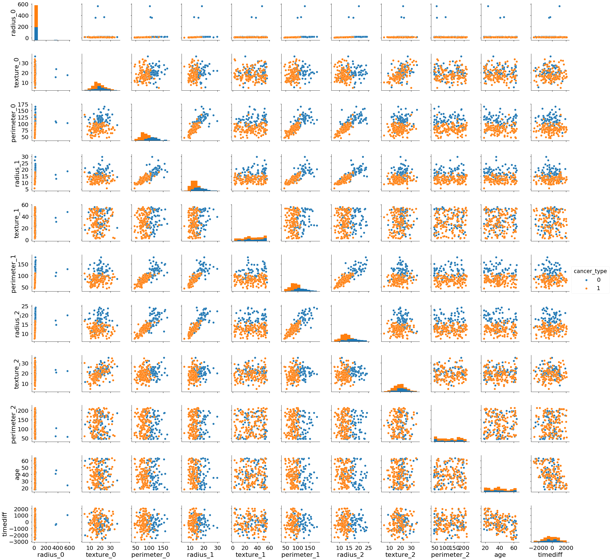


* Here we can see that:
    * Radius of the `type_0` cell nuclei, `radius_0` has serious outliers.
    * Looking at the scatter plot there are some distinct groupings of the points, which might indicate there could be some clustering going on.
        * Some of the variables such as `radius_1` or `perimeter_1` are important factors to distinguish different cancer types. For example higher values of these variables are likely to belong to type_1 and vice versa.
    * High positive covariance is is visible between some of the variables such as `perimeter_0` and `radius_2`; `radius_1` and `radius_2`. This relationship will be better seen in the following heatmap plot for variable correlations.
    * A negative linear relationship can be seen for `timediff` ~ `age`. Since the cancer can be diagnosed in a routine control and older people are more likely to have a routine health check-up or control the time difference between `treatment_date` and `diagnosis_date` is less than younger people.
    * The distributions of the variables are further investigated in the following plots.

* Next we'll use another tool `parallel_coordinates` plot from Pandas.plotting library for visualizing high dimensional multivariate data.
* A parallel coordinate plot maps each row in the data as a line.
* Each attribute of a row is represented by a point on the line.
* Coloring the lines by target class, here `cancer_type` allows to see any patterns or clustering.


```python
import matplotlib

from pandas.plotting import parallel_coordinates
```


```python
fig = plt.figure(figsize=(15,15))
_ = parallel_coordinates(train.drop('timediff', axis=1), 'cancer_type',)
```


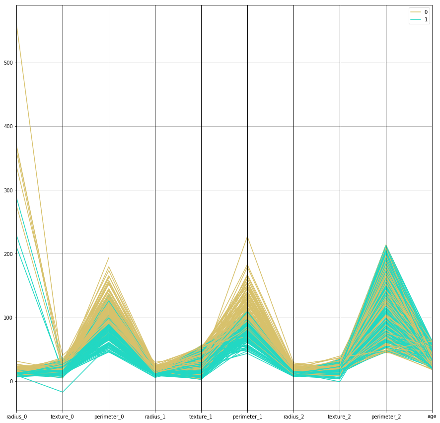


__Notes__:
* Outliers in `radius_0` (the most) and `perimeter_0` and `perimeter_1` (less).
* `perimeter_0`, `radius_1`, `perimeter_1`, `radius_2` are the variables that split the different `cancer_type` fairly clearly. `cancer_type_0` have higher values for all these variables.

* Next we'll draw categorical scatterplots for the data.
* Swarms of the numerical variables are grouped by target.
* Pros: Better representation of the distribution of values.
* Cons: It does not scale as well to large numbers of observations (not a problem here).


```python
colnames = train.drop(labels="cancer_type", axis=1).columns
fig, axes = plt.subplots(4, 3, figsize=(15,15))
counter = 0

for row in range(4):
    for col in range(3):
        ax_curr = axes[row, col]
        sns.swarmplot(x='cancer_type', y=colnames[counter], data=train, ax=ax_curr)
        counter += 1
        if  counter == len(colnames):
            break
```


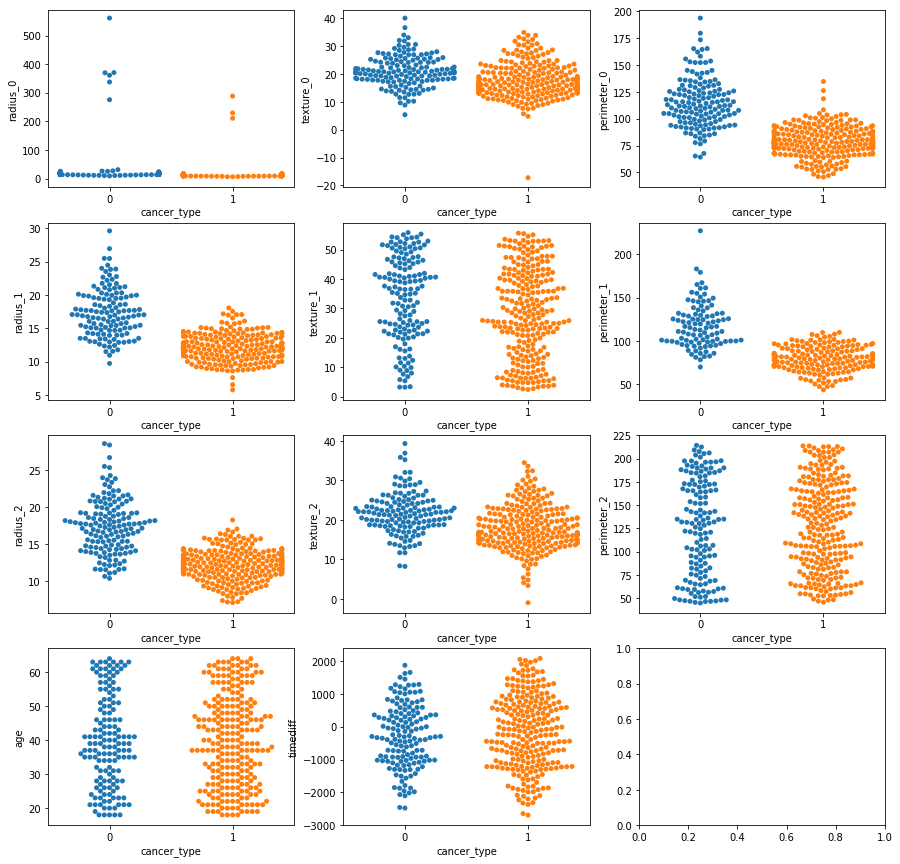


* Data size allows us to examine with bee swarm plots.
* `radius_0`: Outliers block the visual.
* `texture_0`: Similar distribution for different types of cancer. An outlier is visible in this data.
* `perimeter_0`: Positive skewed distribution for type_0, minor outliers. type_1 more likely to have lower value.
* `radius_1`: Positive skewed distribution for type_0, minor outliers. type_1 more likely to have lower value.
* `texture_1`: A uniform distribution. No outliers. type_0 more likely to have higher values.
* `perimeter_1`: Positive skewed distribution for type_0, minor outliers. type_1 more likely to have lower value.
* `radius_2`: Positive skewed distribution or normal distribution. More visible for type_0. type_1 more likely to have lower value.
* `texture_2`: More like a normal distribution.
* `perimeter_2`: A uniform distribution. No outliers.
* `age`: A uniform distribution. No outliers.
* `timediff`: A nice normal distribution.

We'll see whether the distributions are normal in the next plot.

* So, next step is to define `ecdf` function, i.e. empirical cumulative distribution function to further investigate the data and its distribution.


```python
def ecdf(data):
    """Compute ECDF for a one-dimensional array of measurements."""

    # Number of data points: n
    n = len(data)

    # x-data for the ECDF: x
    x = np.sort(data)

    # y-data for the ECDF: y
    y = np.arange(1, n + 1) / n

    return x, y
```


```python
fig, axes = plt.subplots(4, 3, figsize=(15,15))
counter = 0

for row in range(4):
    for col in range(3):
        colname = colnames[counter]
        mean_0 = train.loc[train['cancer_type'] == 0, colname].mean()
        std_0 = train.loc[train['cancer_type'] == 0, colname].std()
        samples_0 = np.random.normal(mean_0, std_0, size=10000)
        x_theor_0, y_theor_0 = ecdf(samples_0)

        mean_1 = train.loc[train['cancer_type'] == 1, colname].mean()
        std_1 = train.loc[train['cancer_type'] == 1, colname].std()
        samples_1 = np.random.normal(mean_1, std_1, size=10000)
        x_theor_1, y_theor_1 = ecdf(samples_1)


        x0, y0 = ecdf(train.loc[train['cancer_type'] == 0, colname].dropna().values)
        x1, y1 = ecdf(train.loc[train['cancer_type'] == 1, colname].dropna().values)

        # Generate plot
        _ = axes[row, col].plot(x_theor_0, y_theor_0, c='red', alpha=0.6)
        _ = axes[row, col].plot(x_theor_1, y_theor_1, c='blue', alpha=0.6)
        _ = axes[row, col].plot(x0, y0, marker = '.', linestyle = 'none', c='gray', alpha=0.6)
        _ = axes[row, col].plot(x1, y1, marker = '.', linestyle = 'none', c='orange', alpha=0.4)

        # Make the margins nice
        _ = axes[row, col].margins(0.02)

        # Label the axes
        axes[row, col].legend(('theor_0', 'theor_1', 'type_0', 'type_1',), loc='lower right')
        _ = axes[row, col].set_xlabel(colname)
        _ = axes[row, col].set_ylabel('CDF')
        counter += 1
        if  counter == len(colnames):
            break
```


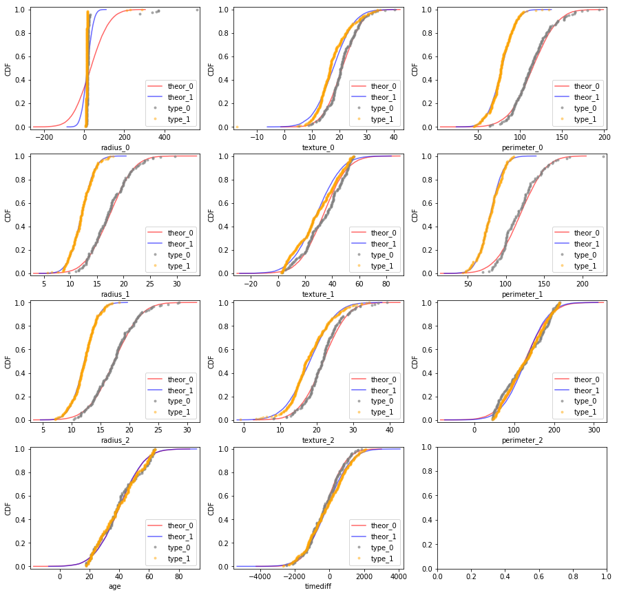


__Notes__:
* Checking if the distributions are normally distributed.
* Looking at CDF is more effective than PDF since there is no binning bias.
* To compute the theoretical CDF by sampling we passed two parameters to `np.random.normal` which are `mean` and `std`.
* The values we choose are directly calculated from the data.
* The result is that for the some of the features the emprical CDF overlayed beautifully to the theoretical CDF.
* The emprical CDF plots are also helpful for larger datasets to observe the percentiles.
* We can apply similar technique to check the distribution of individual column. For example, `perimeter_2` is more likely to have a uniform distribution.


```python
fig = plt.figure(figsize=(12,10))

_ = sns.heatmap(train.corr(), annot=True,  cmap="YlGnBu")
```


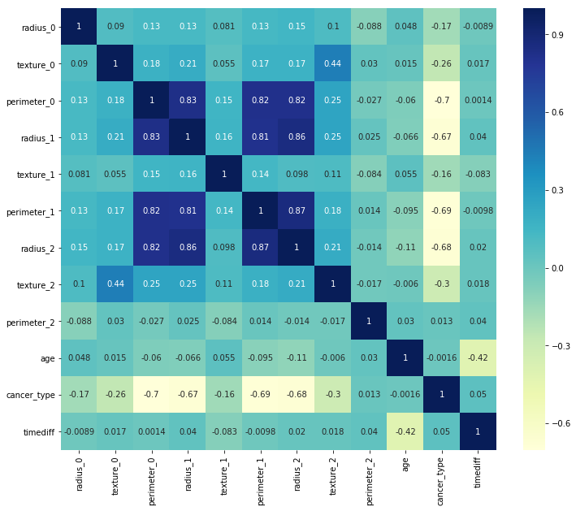


* `perimeter_0`, `radius_1`, `perimeter_1`, `radius_2` have strong correlations with each other. This may effect the models performance if we use a linear model.
* On the other side, negative correlation of these variables with the target variable is good.
* `age` and `timediff` have some negative correlation that explained before.

Next: Let's seperate target and feature data and get them ready for modeling.


```python
y = train['cancer_type']
X = train.drop('cancer_type', axis=1)
```

We will next deal with missing values with the help of `Imputer` class.


```python
from sklearn.preprocessing import Imputer

imp = Imputer(strategy='median')

imp.fit(X)
```


    Imputer(axis=0, copy=True, missing_values='NaN', strategy='median', verbose=0)


* We have skewed distributions for some of the variables, it is best to use `median` for the `strategy` parameter.


```python
# Median for each column.

imp.statistics_
```


    array([  13.46816957,   18.23874229,   87.37676402,   13.38578926,
             30.89776198,   90.0546129 ,   13.33361036,   19.43609425,
            129.99269664,   39.        , -244.5       ])


* The test data might have missing values for other columns as well. Thus we fitted the Imputer to all 11 numeric columns.


```python
X_imp = imp.transform(X)
```

* Another important section: Scaling. We have outliers and skewed datasets. For the modeling part of the analysis we will possibly need a scaled dataset.


```python
from sklearn.preprocessing import QuantileTransformer

scaler = QuantileTransformer(output_distribution='normal')

scaler.fit(X_imp)
```


    QuantileTransformer(copy=True, ignore_implicit_zeros=False, n_quantiles=1000,
              output_distribution='normal', random_state=None,
              subsample=100000)


```python
X_sca = scaler.transform(X_imp)
```

__Notes__:
* `QuantileTransformer` applies a non-linear transformation such that the probability density function of each feature will be mapped to a Gaussian distribution (`output_distribution='normal'`).
* In this case, all the data will be mapped in the range [0, 1], even the outliers which cannot be distinguished anymore from the inliers.
* `QuantileTransformer` will also automatically collapse any outlier by setting them to the a priori defined range boundaries (0 and 1).
* As a negative side, this non-parametetric transformer introduces saturation artifacts for extreme values.


```python
with sns.plotting_context("notebook", font_scale=2):
    _ = sns.pairplot(pd.DataFrame(X_sca, columns=X.columns))
```


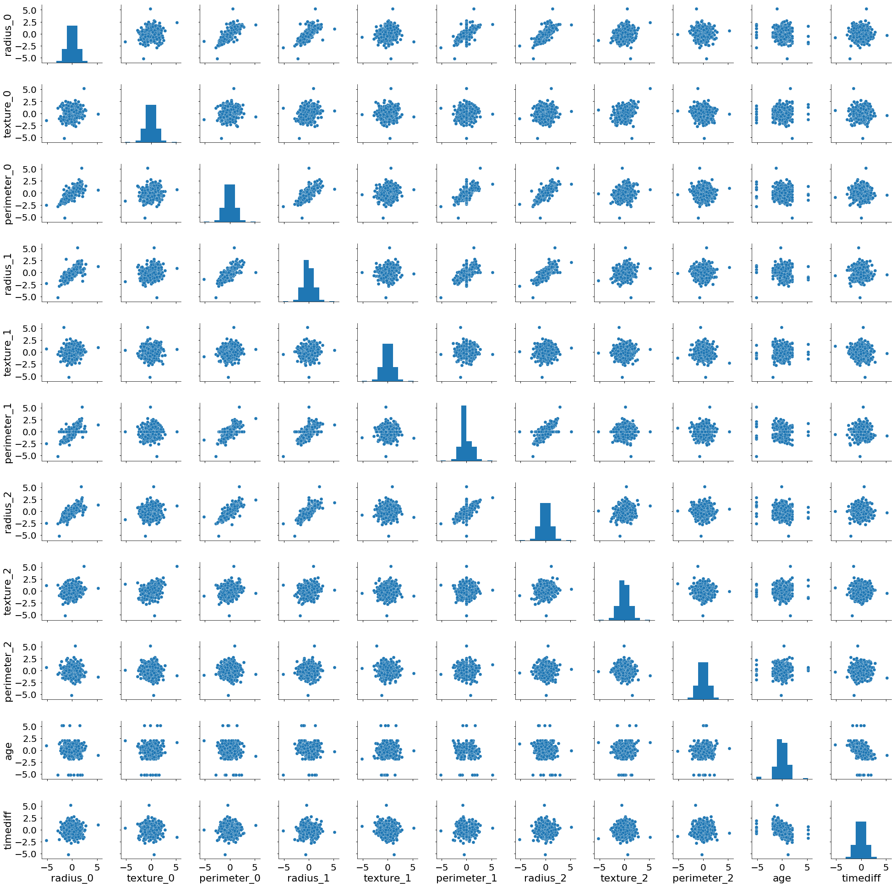


* If we talk about Logistic Regression, the independent variables do not need to be multivariate normal – although multivariate normality yields a more stable solution.

## Modeling

Create a model for predicting the `cancer_type` and keep it simple.


```python
from sklearn.model_selection import train_test_split

X_train, X_test, y_train, y_test = train_test_split(X_sca, y, test_size=0.25, random_state=42, stratify=None)
```

* `stratify=None` is by default. So the data is split in a stratified fashion, using this as the class labels, i.e. class ratio for the target variable is kept among splits.


```python
Counter(y_train)
```


    Counter({0: 108, 1: 190})


```python
Counter(y_test)
```


    Counter({0: 40, 1: 60})


* cancer_type_0 / cancer_type_1 approximately kept constant.

### Logistic Regression


```python
from sklearn.linear_model import LogisticRegressionCV
```


```python
log_reg = LogisticRegressionCV(class_weight='balanced', cv=3, solver='liblinear')
log_reg.fit(X_train, y_train)
```


    LogisticRegressionCV(Cs=10, class_weight='balanced', cv=3, dual=False,
               fit_intercept=True, intercept_scaling=1.0, max_iter=100,
               multi_class='ovr', n_jobs=1, penalty='l2', random_state=None,
               refit=True, scoring=None, solver='liblinear', tol=0.0001,
               verbose=0)


* `C` is the regularization term (here `penalty=l2`)
* `Cs` parameter is the number of regularization term to be searched (here is 10).
* Regularization addresses the multi-collinearity problem that we mentioned with some of the variables.
* Regularization improves the generalization performance, i.e., the performance on new, unseen data.


```python
log_reg.C_
```


    array([ 0.35938137])


* Lower C ('l2') means more regularized model.


```python
y_pred_log = log_reg.predict(X_test)
```


```python
from sklearn import metrics
```


```python
metrics.confusion_matrix(y_test, y_pred_log)
```


    array([[34,  6],
           [ 6, 54]])


```python
print(metrics.classification_report(y_test, y_pred_log, labels=None, target_names=['cancer_type_0', 'cancer_type_1'], sample_weight=None, digits=2))
```

                   precision    recall  f1-score   support

    cancer_type_0       0.85      0.85      0.85        40
    cancer_type_1       0.90      0.90      0.90        60

      avg / total       0.88      0.88      0.88       100


* Balance between `precision` and `recall` is achieved for the `X_test`.


```python
y_score_log = log_reg.decision_function(X_test)
```

* `decision_function` method of `LogisticRegressionCV` class predicts confidence scores for samples. We'll need this to draw PR curve and ROC curve.


```python
from sklearn.metrics import precision_recall_curve

precision_log, recall_log, threshold_log = precision_recall_curve(y_test, y_score_log)
```


```python
from sklearn.metrics import average_precision_score
average_precision_log = average_precision_score(y_test, y_score_log)

print('Average precision-recall score: {0:0.2f}'.format(
      average_precision_log))
```

    Average precision-recall score: 0.94


```python
_ = plt.figure(figsize=(8,6))

_ = plt.step(recall_log, precision_log, color='b', alpha=0.2,
         where='post')
_ = plt.fill_between(recall_log, precision_log, step='post', alpha=0.2,
                 color='b')

_ = plt.xlabel('Recall', fontsize=14)
_ = plt.ylabel('Precision', fontsize=15)
_ = plt.ylim([0.0, 1.02])
_ = plt.xlim([0.0, 1.0])
_ = plt.title('Log_Reg 2-class Precision-Recall curve: area={0:0.2f}'.format(
          average_precision_log), fontsize=14)
```


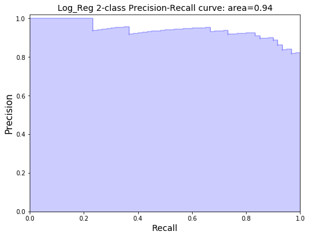


* PR curve is plotted by measuring precision and recall at various threshold values.
* This curve is preferred whenever positive class (here `type_0`) is rare or when false positives are more important than false negatives.
* We have slightly less type_0 samples, however false positives (predicted:0 actual:1) are not more important than false negatives (predicted: 1, actual: 0).
* A more clear explanation would be, PR curve is better for rare positive class or problems where "positive" class is more interesting than the negative class.


```python
from sklearn.metrics import roc_curve

fpr_log, tpr_log, thresholds_log = roc_curve(y_test, y_score_log)
```


```python
from sklearn.metrics import roc_auc_score

roc_auc_log = roc_auc_score(y_test, y_score_log)
```


```python
def plot_roc_curve(fpr, tpr, **options):
    plt.plot(fpr, tpr, linewidth=2, **options)
    plt.plot([0, 1], [0, 1], 'k--')
    plt.fill_between(fpr, tpr, step='post', alpha=0.2,
                 color='b')
    plt.axis([0, 1, 0, 1])
    plt.xlabel('False Positive Rate', fontsize=16)
    plt.ylabel('True Positive Rate', fontsize=16)

plt.figure(figsize=(8, 6))
plot_roc_curve(fpr_log, tpr_log, label='ROC curve (area = %0.2f)' % roc_auc_log)
plt.legend(loc="lower right", fontsize=12)
#save_fig("roc_curve_plot")
plt.show()
```


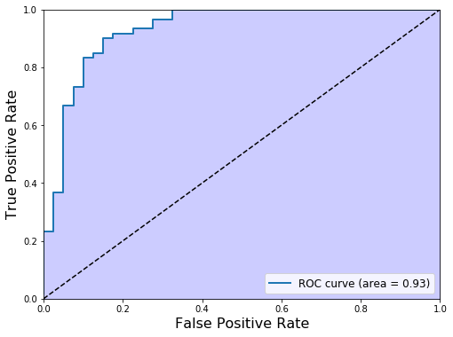


* ROC curve is plotted by measuring recall (true positive rate, sensitivity) and false positive rate (1 - specifity) at various threshold values.
* It is mentioned that the PR curve is preferred whenever positive class (here `type_0`) is rare or when false positives are more important than false negatives. The ROC curve is used otherwise
* If we think that our target class is balanced enough or false negatives (predicted: `type_1`, actual: `type_0`) are more important than false positives (predicted: `type_0`, actual: `type_1`), then ROC curve is the plot to look.

### Support Vector Machine


```python
from sklearn.svm import SVC
from sklearn.model_selection import GridSearchCV
```


```python
param_grid = [
  {'C': [1, 10, 100, 1000], 'kernel': ['linear'], 'class_weight': [{0: 2}, {0: 3}, {0: 4}]},
  {'C': [1, 10, 100, 1000], 'kernel': ['poly'], 'class_weight': [{0: 2}, {0: 3}, {0: 4}], 'degree': [2, 3, 4]},
  {'C': [1, 10, 100, 1000], 'kernel': ['rbf'], 'class_weight': [{0: 2}, {0: 3}, {0: 4}], 'gamma': [0.1, 0.01, 0.001, 0.0001]},
 ]
```

__Notes__:
* Normally we should do a coarse grid search over hyperparameters then a finer search. The size of the dataset allowed us to look all at once.
* C: Regularization parameter. Higher C means less regularization.
* kernel: `linear`, `poly` (Polynomial) or `rbf` (Gaussian Radial Basis Function).
* degree: Only in `poly`


```python
svc = GridSearchCV(SVC(), param_grid, cv=3)
svc.fit(X_train, y_train)
```


    GridSearchCV(cv=3, error_score='raise',
           estimator=SVC(C=1.0, cache_size=200, class_weight=None, coef0=0.0,
      decision_function_shape='ovr', degree=3, gamma='auto', kernel='rbf',
      max_iter=-1, probability=False, random_state=None, shrinking=True,
      tol=0.001, verbose=False),
           fit_params=None, iid=True, n_jobs=1,
           param_grid=[{'class_weight': [{0: 2}, {0: 3}, {0: 4}], 'kernel': ['linear'], 'C': [1, 10, 100, 1000]}, {'class_weight': [{0: 2}, {0: 3}, {0: 4}], 'degree': [2, 3, 4], 'kernel': ['poly'], 'C': [1, 10, 100, 1000]}, {'class_weight': [{0: 2}, {0: 3}, {0: 4}], 'kernel': ['rbf'], 'C': [1, 10, 100, 1000], 'gamma': [0.1, 0.01, 0.001, 0.0001]}],
           pre_dispatch='2*n_jobs', refit=True, return_train_score=True,
           scoring=None, verbose=0)


* `coef`: This hyperparameter controls how much the model is influenced by high-degree versus low-degree polynomials.

__Notes__:
* `class_weight = balanced` since we have slightly skewed target data.
* `scoring = f1` since we need to predict both classes correctly. F1 Score balances `precision` and `recall`.
    * Recall: Number of positive predictions divided by the number of positive class values in the test data.
    * Precision: Number of positive predictions divided by the total number of positive class values predicted.


```python
print(svc.best_params_)
```

    {'class_weight': {0: 2}, 'kernel': 'rbf', 'C': 1, 'gamma': 0.1}


```python
y_pred_svc = svc.predict(X_test)
```


```python
metrics.confusion_matrix(y_test, y_pred_svc)
```


    array([[32,  8],
           [ 5, 55]])


```python
print(metrics.classification_report(y_test, y_pred_svc, labels=None, target_names=['cancer_type_0', 'cancer_type_1'], sample_weight=None, digits=2))
```

                   precision    recall  f1-score   support

    cancer_type_0       0.86      0.80      0.83        40
    cancer_type_1       0.87      0.92      0.89        60

      avg / total       0.87      0.87      0.87       100


* Overall not better than `LogisticRegression` if we also think the hyperparameters to tune and time complexity that this algorithm has with the larger datasets.


```python
y_score_svc = svc.decision_function(X_test)
```


```python
precision_svc, recall_svc, threshold_svc = precision_recall_curve(y_test, y_score_svc)
```


```python
average_precision_svc = average_precision_score(y_test, y_score_svc)

print('Average precision-recall score: {0:0.2f}'.format(
      average_precision_svc))
```

    Average precision-recall score: 0.95


```python
_ = plt.figure(figsize=(8, 6))
_ = plt.step(recall_svc, precision_svc, color='b', alpha=0.2,
         where='post')
_ = plt.fill_between(recall_svc, precision_svc, step='post', alpha=0.2,
                 color='b')

_ = plt.xlabel('Recall', fontsize=14)
_ = plt.ylabel('Precision', fontsize=14)
_ = plt.ylim([0.0, 1.02])
_ = plt.xlim([0.0, 1.0])
_ = plt.title('SVC 2-class Precision-Recall curve: area={0:0.2f}'.format(
          average_precision_svc), fontsize=14)
```


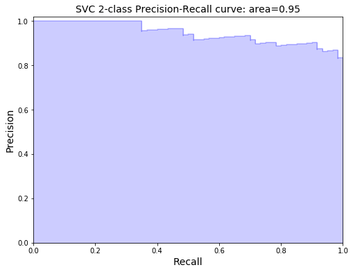


```python
fpr_svc, tpr_svc, thresholds_svc = roc_curve(y_test, y_score_svc)
```


```python
roc_auc_svc = roc_auc_score(y_test, y_score_svc)
```


```python
plt.figure(figsize=(8, 6))
plot_roc_curve(fpr_svc, tpr_svc, label='ROC curve (area = %0.2f)' % roc_auc_svc)
plt.legend(loc="lower right", fontsize=12)
#save_fig("roc_curve_plot")
plt.show()
```


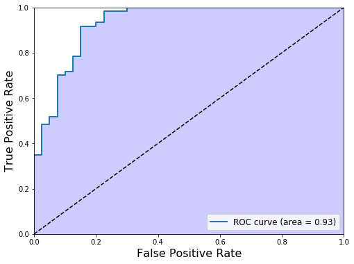


## Test Dataset


```python
test['timediff'] = (test['treatment_date'] - test['diagnose_date']).dt.days
test.drop(labels=['treatment_date', 'diagnose_date'], axis=1, inplace=True)
test['texture_2'] = pd.to_numeric(train['texture_2'], errors='coerce')
```


```python
test.info()
```

    <class 'pandas.core.frame.DataFrame'>
    RangeIndex: 171 entries, 0 to 170
    Data columns (total 11 columns):
    radius_0       171 non-null float64
    texture_0      171 non-null float64
    perimeter_0    171 non-null float64
    radius_1       146 non-null float64
    texture_1      171 non-null float64
    perimeter_1    105 non-null float64
    radius_2       171 non-null float64
    texture_2      164 non-null float64
    perimeter_2    171 non-null float64
    age            171 non-null int64
    timediff       171 non-null int64
    dtypes: float64(9), int64(2)
    memory usage: 14.8 KB


```python
test_imp = imp.transform(test)
```


```python
test_sca = scaler.transform(test_imp)
```


```python
results_log = log_reg.predict(test_sca)
```


```python
results_log = pd.Series(results_log, name='cancer_type')
results_log.to_csv("results/submission_log.csv", index=False, header=True)
```


```python
#results_svc = svc.predict(test_sca)
```


```python
#results_svc = pd.Series(results_svc, name='cancer_type')
#results_svc.to_csv("results/submission_svc.csv", index=False)
```

## Further Analysis

### Feature Selection


```python
from sklearn.feature_selection import SelectFromModel
from sklearn.ensemble import RandomForestClassifier
```


```python
select = SelectFromModel(
    RandomForestClassifier(n_estimators=100, random_state=42),
    threshold='median')
```


```python
select.fit(X_train, y_train)
```


    SelectFromModel(estimator=RandomForestClassifier(bootstrap=True, class_weight=None, criterion='gini',
                max_depth=None, max_features='auto', max_leaf_nodes=None,
                min_impurity_decrease=0.0, min_impurity_split=None,
                min_samples_leaf=1, min_samples_split=2,
                min_weight_fraction_leaf=0.0, n_estimators=100, n_jobs=1,
                oob_score=False, random_state=42, verbose=0, warm_start=False),
            norm_order=1, prefit=False, threshold='median')


```python
X_train_l1 = select.transform(X_train)
```


```python
print("X_train.shape: {}".format(X_train.shape))
print("X_train_l1.shape: {}".format(X_train_l1.shape))
```

    X_train.shape: (298, 11)
    X_train_l1.shape: (298, 6)


```python
X_test_l1 = select.transform(X_test)
```


```python
score_before = log_reg.score(X_test, y_test)
print("Test score before: {:.3f}".format(score_before))
score = LogisticRegressionCV(class_weight='balanced', cv=5, solver='liblinear').fit(X_train_l1, y_train).score(X_test_l1, y_test)
print("Test score after: {:.3f}".format(score))
```

    Test score before: 0.880
    Test score after: 0.870


### Interaction


```python
from sklearn.preprocessing import PolynomialFeatures
```


```python
poly_transformer = PolynomialFeatures(degree=2, interaction_only=True, include_bias=False)
```


```python
temp_train = poly_transformer.fit_transform(X_train)
```


```python
temp_test = poly_transformer.transform(X_test)
```


```python
LogisticRegressionCV(class_weight='balanced', cv=5, solver='liblinear').fit(temp_train, y_train).score(temp_test, y_test)
```


    0.88


```python
metrics.confusion_matrix(y_test, LogisticRegressionCV(class_weight='balanced', cv=5, solver='liblinear').fit(temp_train, y_train).predict(temp_test))
```


    array([[32,  8],
           [ 4, 56]])


## radius_2 ~ perimeter_1

Build a regression model for predicting `radius_2` based on `perimeter_1`.


```python
# Load the original data.

temp_train = pd.read_csv("candidate_data/train_data.csv", parse_dates=['treatment_date', 'diagnose_date'])
```


```python
temp_train[["perimeter_1", "radius_2"]].info()
```

    <class 'pandas.core.frame.DataFrame'>
    RangeIndex: 398 entries, 0 to 397
    Data columns (total 2 columns):
    perimeter_1    264 non-null float64
    radius_2       398 non-null float64
    dtypes: float64(2)
    memory usage: 6.3 KB


```python
temp_prm1_rad2 = temp_train[["perimeter_1", "radius_2"]].dropna()

prm1 = temp_prm1_rad2.perimeter_1.values  # perimeter of the cell type 1 as Numpy array.
rad2 = temp_prm1_rad2.radius_2.values     # radius of the cell type 2 as Numpy array.
```


```python
# Plot a scatter plot for the x="perimeter_1" and y="radius_2" variables.

_ = sns.lmplot("perimeter_1", "radius_2", data=temp_prm1_rad2, fit_reg=False)
```


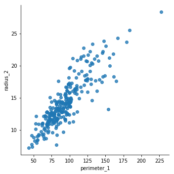


```python
temp_prm1_rad2.corr()
```


<div>
<style>
    .dataframe thead tr:only-child th {
        text-align: right;
    }

    .dataframe thead th {
        text-align: left;
    }

    .dataframe tbody tr th {
        vertical-align: top;
    }
</style>
<table border="1" class="dataframe">
  <thead>
    <tr style="text-align: right;">
      <th></th>
      <th>perimeter_1</th>
      <th>radius_2</th>
    </tr>
  </thead>
  <tbody>
    <tr>
      <th>perimeter_1</th>
      <td>1.000000</td>
      <td>0.866853</td>
    </tr>
    <tr>
      <th>radius_2</th>
      <td>0.866853</td>
      <td>1.000000</td>
    </tr>
  </tbody>
</table>
</div>


* We did some EDA ahead of our analysis.
* To this end, we plotted the `radius_2` versus `perimeter_1` and computed the Pearson correlation coefficient.

### Bootstrap Linear Regression

* Building a regression model for predicting radius_2 based on perimeter_1. We want that the model should be able to quantify its prediction reliability.
* Statistically speaking, we want to know what would the slope and intercept be if we get the data over and over again.
* We can perform bootstrap estimates to get the confidence intervals on the slope and the intercepts.

__Notes__:
* Resampling is sampling with replacement. Bootstrap is the use of resampled data to perform statistical inference.
    * A bootstrap sample is an array of length n that was drawn from the original data with replacement.
    * A bootstrap replicate is a single value of a statistic computed from a bootstrap sample.
* Resample in pairs.
* Following function performs pairs bootstrap for linear regression.
    * We fit linear model to bootstrap samples.


```python
def draw_bs_pairs_linreg(x, y, size=1):
    """Perform pairs bootstrap for linear regression."""

    # Set up array of indices to sample from: inds
    inds = np.arange(len(x))

    # Initialize replicates: bs_slope_reps, bs_intercept_reps
    bs_slope_reps = np.empty(size)
    bs_intercept_reps = np.empty(shape=size)

    # Generate replicates
    for i in range(size):
        bs_inds = np.random.choice(inds, size=len(inds)) # sampling the indices (1d array requirement)
        bs_x, bs_y = x[bs_inds], y[bs_inds]
        bs_slope_reps[i], bs_intercept_reps[i] = np.polyfit(bs_x, bs_y, 1)

    return bs_slope_reps, bs_intercept_reps
```

* `numpy.polyfit(x, y, degree)` is used for least squares linear fit.
* Next we'll generate replicates of `slope` and `intercept` using pairs bootstrap.


```python
# Generate replicates of slope and intercept using pairs bootstrap
bs_slope_reps, bs_intercept_reps = draw_bs_pairs_linreg(x=prm1, y=rad2, size=5000)
```

* Following is the plot of the bootstrap lines.


```python
# Generate array of x-values for bootstrap lines: x
x = np.array([20, 240])
plt.figure(figsize=(10, 8))

# Plot the bootstrap lines
for i in range(1000):
    _ = plt.plot(x, bs_slope_reps[i]*x + bs_intercept_reps[i],
                 linewidth=0.5, alpha=0.2, color='red')

# Plot the data
_ = plt.plot(prm1, rad2, marker='.', linestyle='none')

# Label axes, set the margins, and show the plot
_ = plt.xlabel('perimeter_1', fontsize=16)
_ = plt.ylabel('radius_2', fontsize=16)
plt.margins(0.02)
plt.show()
```


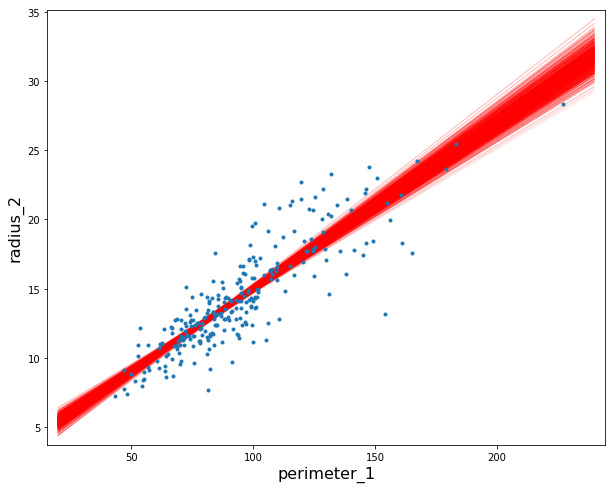


* How the results may change upon repeated measurements? We'll compute confidence intervals for the `slope` and `intercept`.


```python
# Compute and print 95% CI for slope
print("95% CI for slope is {}".format(np.percentile(bs_slope_reps, [2.5, 97.5])))

# Plot the histogram
plt.figure(figsize=(10, 8))
_ = plt.hist(bs_slope_reps, bins=50, normed=True, edgecolor="k")
_ = plt.xlabel('slope', fontsize=18)
_ = plt.ylabel('PDF', fontsize=18)
plt.show()
```

    95% CI for slope is [ 0.10972073  0.13023971]


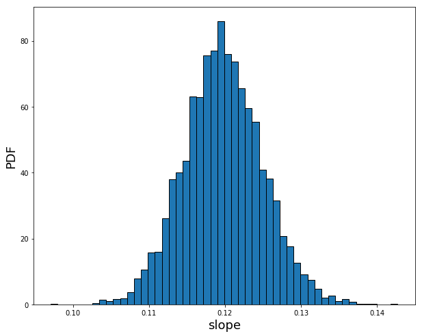


* `normed=True` keyword argument is used in `plt.hist` function. This sets the height of the bars of histogram such that the total area of the bar is equal to one (`normalization`).
* Thus, histogram approximates to a probability density function (Area under the pdf gives the probability).
* We have computed the approximate PDF of the slope we would expect to get if we performed the computation (fitting) 1000 times.


```python
# Compute and print 95% CI for intercept
print("95% CI for intercept is {}".format(np.percentile(bs_intercept_reps, [2.5, 97.5])))

# Plot the histogram
plt.figure(figsize=(10, 8))
_ = plt.hist(bs_intercept_reps, bins=50, normed=True, edgecolor="k")
_ = plt.xlabel('intercept', fontsize=18)
_ = plt.ylabel('PDF', fontsize=18)
plt.show()
```

    95% CI for intercept is [ 2.11654243  3.87416789]


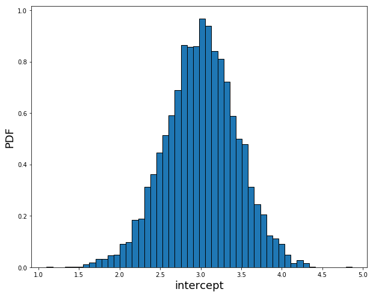


```python
# original data
slp, intrcpt = np.polyfit(prm1, rad2, 1)
print("slope: {0: .3f}, intercept {1: .3f}".format(slp, intrcpt))
```

    slope:  0.119, intercept  3.026


```python

```
